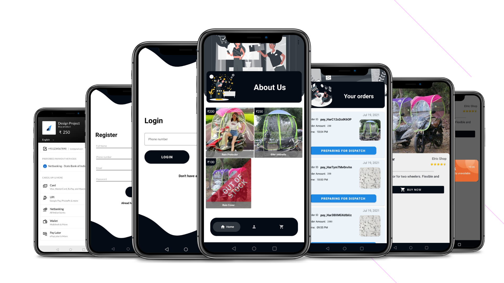

# Design_Project

## Introduction
Most of the two-wheeler riders face problems during rainy season. Even though they use raincoats there are still problems in using it, and those who use rain covers also faces problems. So in this project we are going to identify those problems and come up with a suitable solution for them.

## PROBLEM IDENTIFICATION
### USER STUDY
For user study we performed interviews, observed the users and collected datas from our own experience. And obtained the research data from which we made personas to better understand the user’s experience.
### Persona

### OBJECTIVE
To create a rain protector for motorbikes which is compact, sturdy and less flashy. That can cover most parts of the bike.

# Screenshots

